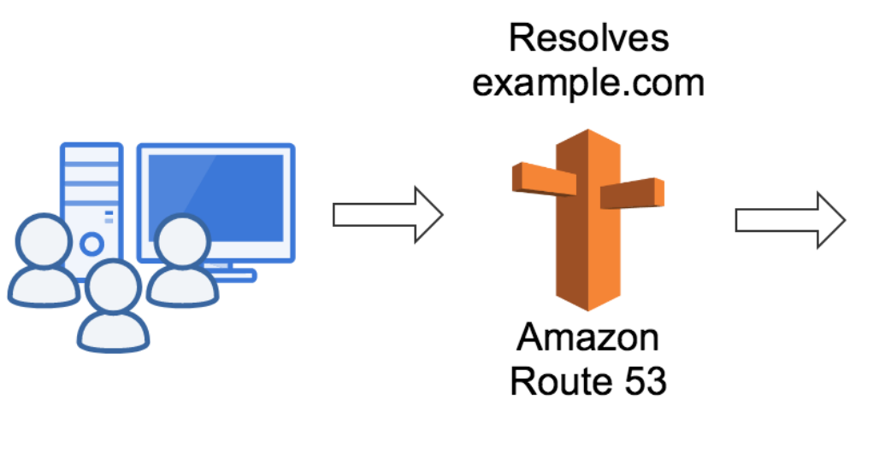
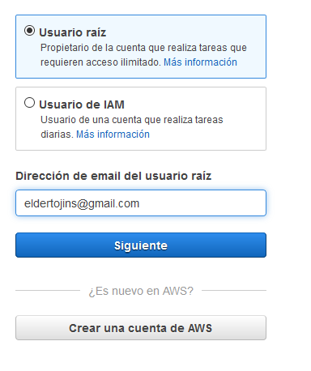
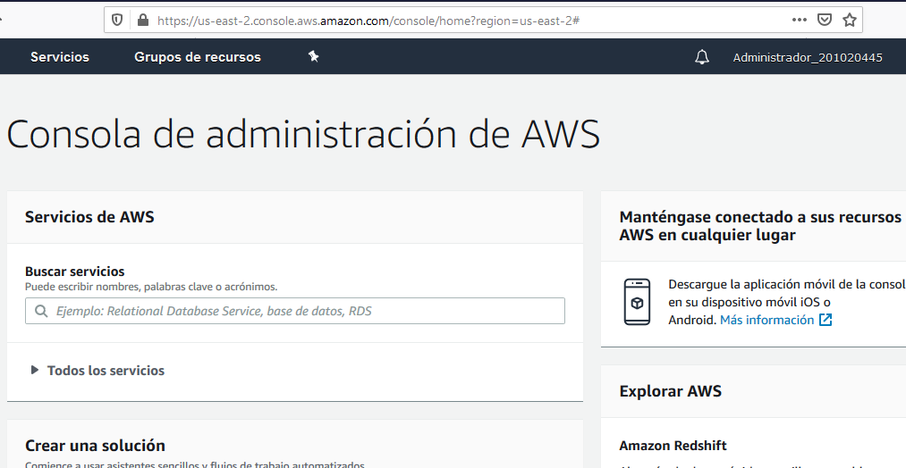
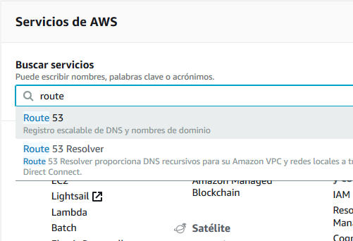
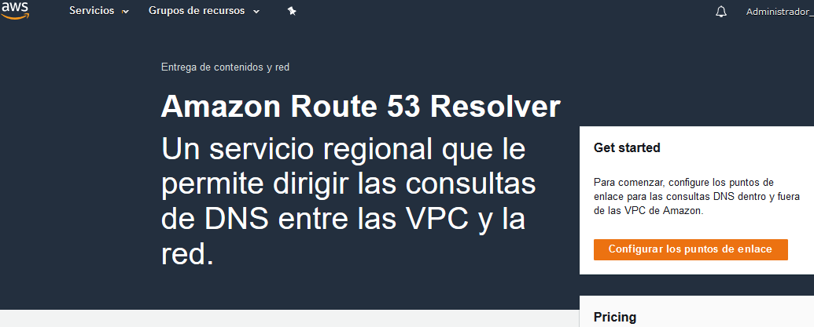
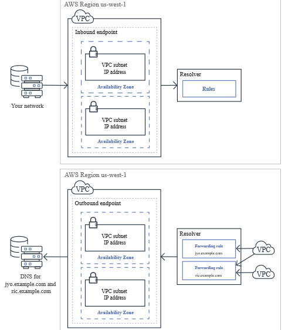
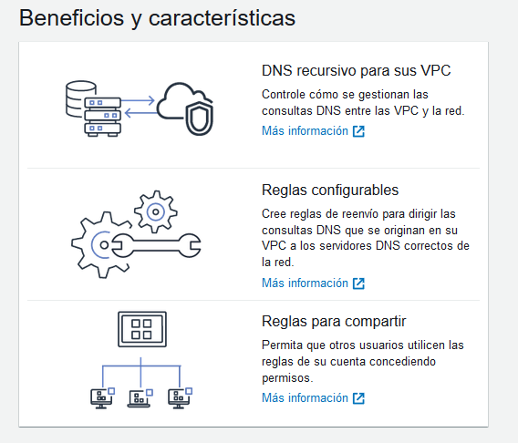

Según la documentación que nos proporciona Amazon, este servicio web basado en DNS registra dominios, realiza direccionamiento de DNS y comprueba estados.
Route 53 permite registrar un nombre de dominio para un sitio web o aplicación web.
En el direccionamiento del tráfico de internet route 53 ayuda a conectar el navegador con el sitio web o aplicación web. 
La siguiente característica de route 53 es el envió de solicitudes para la verificación de que un servidor web esta accesible disponible y operativo, de igual forma elige recibir notificaciones cuando un recurso deja de estar disponible y sacar el trafico de internet a los recursos que están en mal estado.

Este servicio DNS que es de alta disponibilidad en la nube, esta diseñado para ofrecer métodos fiables y rentables para usuarios de internet traduciendo nombres legibles para personas con direcciones ip numéricas que utilizan los equipos para conectarse entre ellos.

Route 53 también puede utilizarse para direccionar usuarios a infraestructuras eternas a AWS, puede utilizar amazon route 53 para configurar comprobaciones de estado de DNS para redirigir el trafico a puntos de enlace en buen estado o controlar de manera independiente el estado de la aplicación y sus puntos de enlace.
Route 53 esta diseñado por aws permitiendo garantizar una capacidad consistente de direccionamiento de los usuarios finales. Amazon route 53 esta diseñado especialmente para ofrecer el nivel de seguridad que necesitan las aplicaciones.

Iniciar sesion en nuestra cuenta de AWS

Buscar el servicio Route53

Elegir Route53

Pantalla de Route53

Indicaciones de funcionamineto

