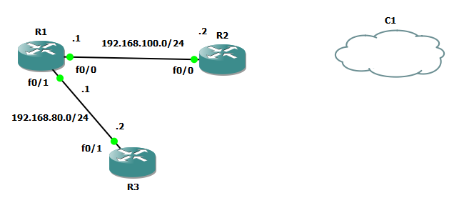

El protocolo DNS por las siglas Domain Name System o sistema de nombre de dominios, es la distribución y jerarquización de almacenamiento de información para los nombres de dominio, este protocolo sirve para asignar a un dominio o direcciones IP, también poder localizar los servidores de correo electrónico que corresponden a cada dominio.
Estos servidores utilizan los protoclos tcp y udp junto con el puerto 53 para responder a las consultas, el dns opera a travez de tres componentes:

Cliente DNS
Servidores DNS
Zonas de autoridad

Cliente dns: son programas que ejecuta un usuario para generar peticiones de consulta.
Servidores dns: son servicios que responden a las consultas realizadas por los clientes dns.
Zonas de autoridad: se divide en consultas iterativas y recursivas, en la que el cliente hace una consulta y el servidor responde de la mejor forma y la recursiva asume la carga para proporcionar una respuesta completa.
Para realizar una consulta se utilizan algunas utilidades como, por ejemplo:

Host: que obtiene la dirección ip que tiene asociada con un nombre de host.
Nslookup: esta utilidad localiza información acerca de nodos de red estableciendo accesibilidad a servidores que contienen los nombres.

Dig: que significa domain internet groper, permitiendo probar servidores y reunir grandes cantidades de información para posteriormente ejecutar consultas de estos nombres de dominio.

En resumen, el dns se utiliza para localizar de forma sencilla los nombres de dominio en lugar de obtener la ip a la que se desea acceder, ingresando más fácilmente a las webs.

TUTORIAL

Crear nuevo proyecto en GNS3

Seleccionar router 2652

Agregar nube para la comunicacion con internet

Asignarle una direccion dhcp al router 

Asignarle el dominio al router

Comandos utilizados

---js esnext

configure terminal
int f0/0
ip address dhcp
no shutdown
end

configure terminal
int f0/0
ip address 192.168.100.100 255.255.255.0
no shutdown
exit

ip domain-lookup
ip name-server 8.8.8.8
end

