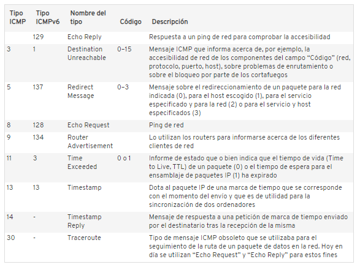

ICMP por las siglas de Internet Control Message Protocol, o bien protocolo de mensajes de control de internet, el cual sirve para la administración de información que se relaciona con los errores que pueden ocurrir en equipos de red, ismp notifica de los errores a los protocolos de capas cercanas.
En este caso ICMP es utilizado en la configuración de los routers para indicar el error que este podría tener, llamado también un error de entrega. De igual forma los servidores utilizan este tipo de protocolo para la devolución de mensajes de problemas.
ICMP es considerado autónomo que trata la implementación de diversos servicios de red por ejemplo traceroute o la utilización de ping, están basados en protocolos ICMP.
Existen diversos tipos de paquetes que son de vital utilidad basados en ICMP, en la tabla siguiente se describen cada tipo de paquete el tipo el nombre el código y una descripción del tipo de paquete.

La importancia que tiene este protocolo es esencial un ejemplo seria la información que llega periódicamente a todos los host o dispositivos participantes de la red, otorgando muchos datos guardando en la cache y haciendo que los routers se conviertan en una puerta de acceso. De esta forma el router optimiza la ruta de los paquetes en la red.
