Iniciaremos describiendo el ruteo como la forma en que se envían paquetes entre redes, existiendo métodos que permiten enviar estos paquetes a su destino de la forma mas optima o en otras palabras eligiendo rutas mas cortas para un mejor desempeño en cuanto a transferencia de paquetes se trate.
Existen métodos para lograr el objetivo de optimización, resumiendo la descripción e historia de estos métodos nos centraremos en el ruteo dinámico, pero específicamente en el protocolo OSPF.

El enrutamiento dinámico puede ser considerado como una técnica eficaz para la optimización de una topología o diseño de red en tiempo real, que por sus características de ejecución sobresale a enrutamientos de otro tipo como por ejemplo el enrutamiento de forma estática, el cual pude considerarse como un método manual y sencillo para especificar con precisión los caminos que debe tomar cada red y como debe hacerlo.
En otras palabras, el enrutamiento dinámico permite a los dispositivos compartir su información con otros dispositivos de red y permiten o no, seleccionar la ruta la cual conlleva a un destino cuya ruta fue optimizada.

Los protocolos que pertenecen a la clasificación de enrutamiento dinámico son de varios tipos y características. Una breve descripción de estos protocolos nos lleva a protocolos de enrutamiento interno a través de vectores de distancia como lo realiza el protocolo Routing Information Protocol conocido como RIP, también se encuentra el protocolo IGRP perteneciente a Cisco cuyas siglas significan Interior Gateway Routing Protocol, también podemos mencionar el protocolo dinámico de enrutamiento exterior de vectores de ruta conocido como BGP entre otras, pero hoy nos centraremos en el protocolo dinámico OSPF.

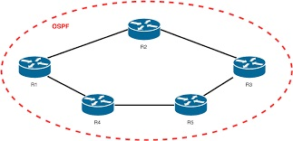

TUTORIAL

Crear proyecto con gns3
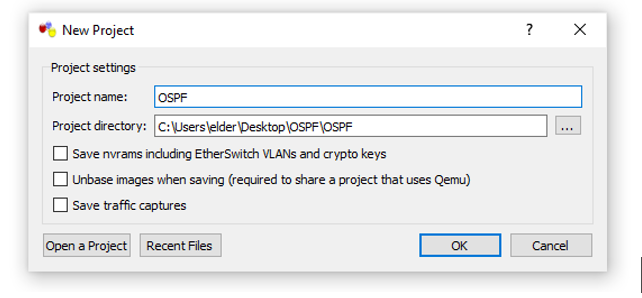

Crear topología con router 2691
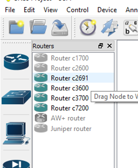

Conectar dispositivos
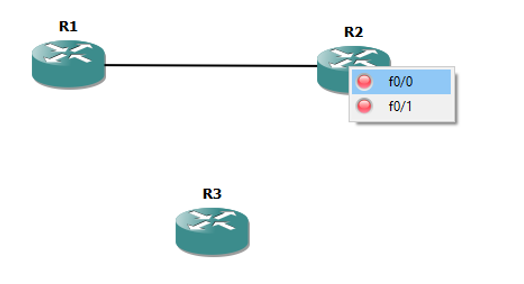

Agregar interfaces a los dispositivos
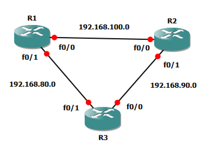

Asignar interfaces a router 1 desde la consola


---js esnext
configure terminal
int f0/0
ip address 192.168.100.1 255.255.255.0
no shutdown
speed 100
full-duplex
end

configure terminal
int f0/1
ip address 192.168.80.1 255.255.255.0
no shutdown
speed 100
full-duplex
end
write memory


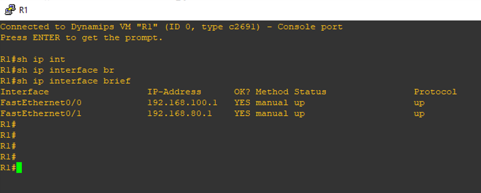

Asignar interfaces a router 2 desde la consola


---js esnext
configure terminal
int f0/0
ip address 192.168.100.2 255.255.255.0
no shutdown
speed 100
full-duplex
end

configure terminal
int f0/1
ip address 192.168.90.1 255.255.255.0
no shutdown
speed 100
full-duplex
end
write memory

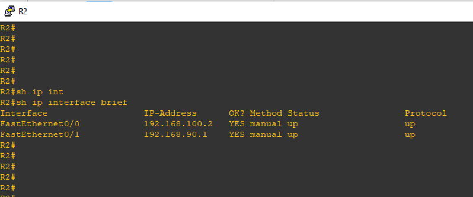

Asignar interfaces a router 3 desde la consola


---js esnext
configure terminal
int f0/0
ip address 192.168.90.2 255.255.255.0
no shutdown
speed 100
full-duplex
end

configure terminal
int f0/1
ip address 192.168.80.2 255.255.255.0
no shutdown
speed 100
full-duplex
end
write memory


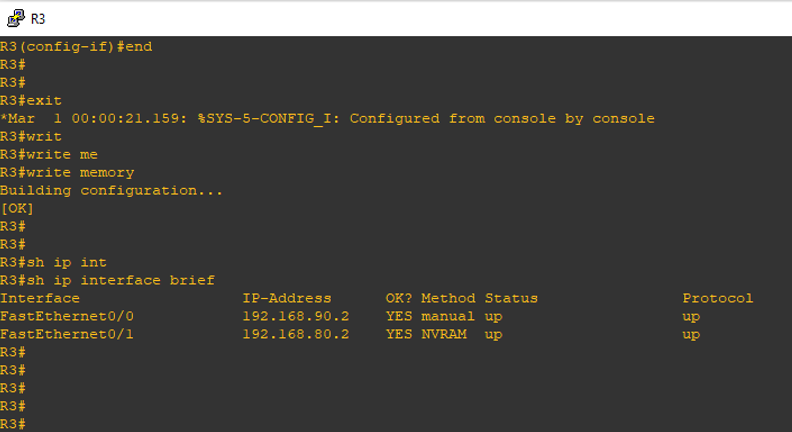

Asignar ospf a los routers

---js esnext
ROUTER 1
configure terminal
router ospf 1
router-id 1.1.1.1
network 192.168.100.0 0.0.0.255 area 0
network 192.168.80.0 0.0.0.255 area 0
passive-interface fastEthernet0/0
auto-cost reference-bandwidth 10000



---js esnext
ROUTER 2
configure terminal
router ospf 1
router-id 2.2.2.2
network 192.168.100.0 0.0.0.255 area 0
network 192.168.90.0 0.0.0.255 area 0
passive-interface fastEthernet0/0
auto-cost reference-bandwidth 10000



---js esnext
ROUTER 3
configure terminal
router ospf 1
router-id 3.3.3.3
network 192.168.80.0 0.0.0.255 area 0
network 192.168.90.0 0.0.0.255 area 0
passive-interface fastEthernet0/0
auto-cost reference-bandwidth 10000


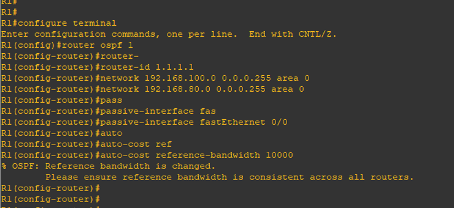
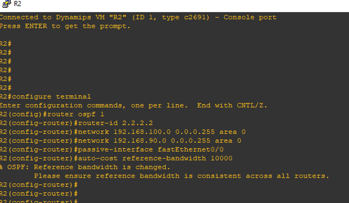
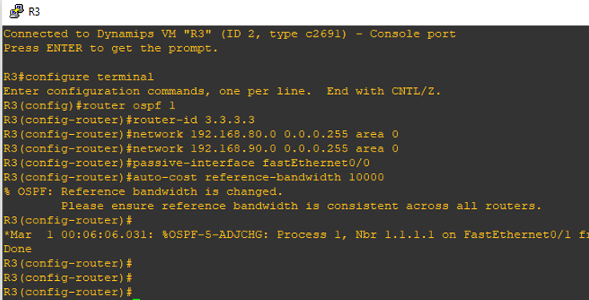

Ver protocolos configurados
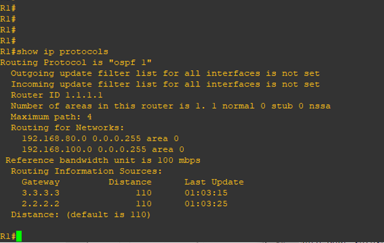

Ver ip configurada con ospf
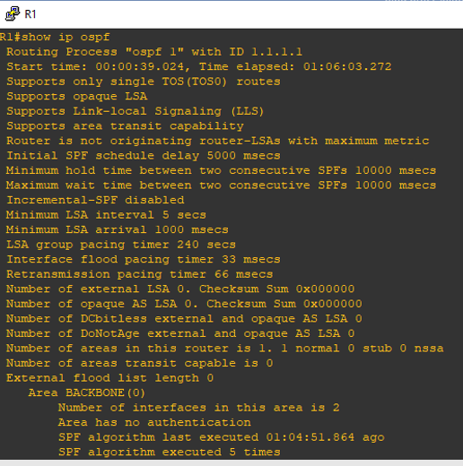

Ver ip de la base de datos configurada con ospf
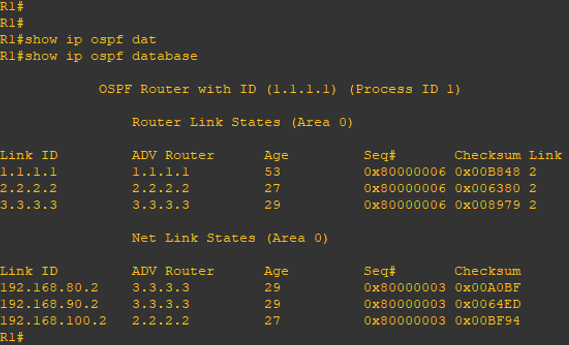